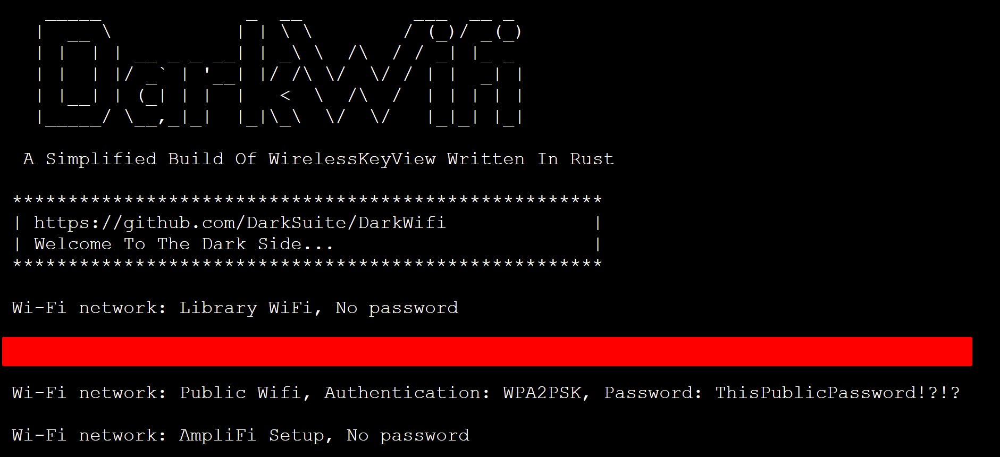

# DarkWifi

[![Forks][forks-shield]][forks-url][![Stargazers][stars-shield]][stars-url][![Issues][issues-shield]][issues-url]

Simplified Rust implementation of the WirelessKeyView tool from the Windows sysinternals toolkit. Used to extract the WiFi networks, authentication standards, and passwords from Windows systems.


<!-- ROADMAP -->
## Build
```console
$ git clone https://github.com/DarkSuite/DarkWifi
$ cd DarkWifi
$ cargo build --release
$ cd target/release
$ ./DarkWifi 
```

<!-- ROADMAP -->
## Usage
```console
$ ./DarkWifi 
```

<p align="center">
  <a href="https://github.com/RioSec/nessusview">
    
  </a>

<!-- CONTRIBUTING -->
## Contributing

Contributions are what make the open source community such an amazing place to be learn, inspire, and create. Any contributions you make are **greatly appreciated**.

1. Fork the Project
2. Create your Feature Branch (`git checkout -b feature/AmazingFeature`)
3. Commit your Changes (`git commit -m 'Add some AmazingFeature'`)
4. Push to the Branch (`git push origin feature/AmazingFeature`)
5. Open a Pull Request

<!-- ISSUES AND REQUESTS -->
## Issues and requests

If you have a problem or a feature request, open an [issue](https://github.com/DarkSuite/DarkWifi/issues).

<!-- STARGAZERS -->

## Stargazers over time

[](https://starchart.cc/DarkSuite/DarkWifi)

<!-- MARKDOWN LINKS & IMAGES -->
<!-- https://www.markdownguide.org/basic-syntax/#reference-style-links -->
[contributors-shield]: https://img.shields.io/github/contributors/DarkSuite/DarkWifi.svg?style=for-the-badge
[contributors-url]: https://github.com/DarkSuite/DarkWifi/graphs/contributors
[forks-shield]: https://img.shields.io/github/forks/DarkSuite/DarkWifi.svg?style=for-the-badge
[forks-url]: https://github.com/DarkSuite/DarkWifi/network/members
[stars-shield]: https://img.shields.io/github/stars/DarkSuite/DarkWifi.svg?style=for-the-badge
[stars-url]: https://github.com/DarkSuite/DarkWifi/stargazers
[issues-shield]: https://img.shields.io/github/issues/DarkSuite/DarkWifi.svg?style=for-the-badge
[issues-url]: https://github.com/DarkSuite/DarkWifi/issues
[license-shield]: https://img.shields.io/github/license/DarkSuite/DarkWifi.svg?style=for-the-badge
[license-url]: https://github.com/DarkSuite/DarkWifi/blob/master/LICENSE
